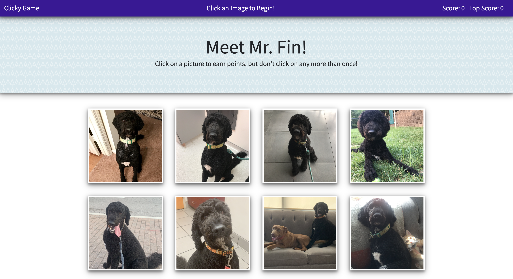

# Clicky-Game

## Description

This application is a simple memorization game that allows the user to select images on the screen and try to remember which images have already been selected. Each time an image is clicked, the images are shuffled on the screen. This app uses React for the front end framework and Bootstrap for the CSS styling. React state and props are used to monitor variables when changed and update the UI. A link to the deployed github pages site can be found below.

## Screenshot

## How To Use
1. Download the github repository to your computer. 
2. Navigate to the project directory in the command line and run npm install to install the necessary node modules.
3. Finally run npm start to start the react application and navigate to localhost://3000 to view the running application. 

## Technologies Used
* React - Javascript library used to create and update the user interface based on changing variable states
* Bootstrap - CSS framework used for stying the application

## Deployed Github Pages App
* [Clicky Game](https://jeff-swanner.github.io/clicky-game/)

## Creator
Jeff Swanner